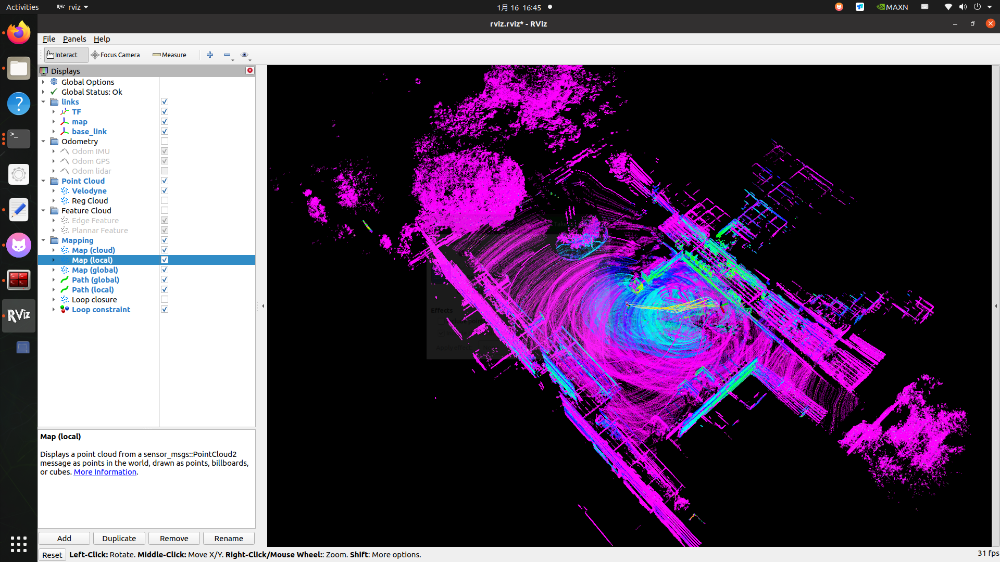
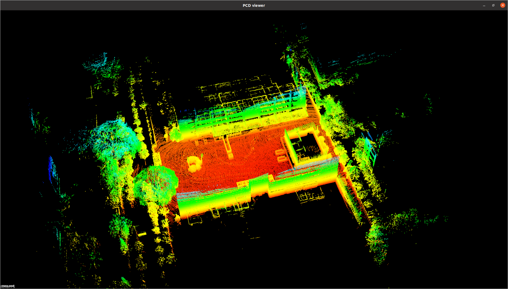
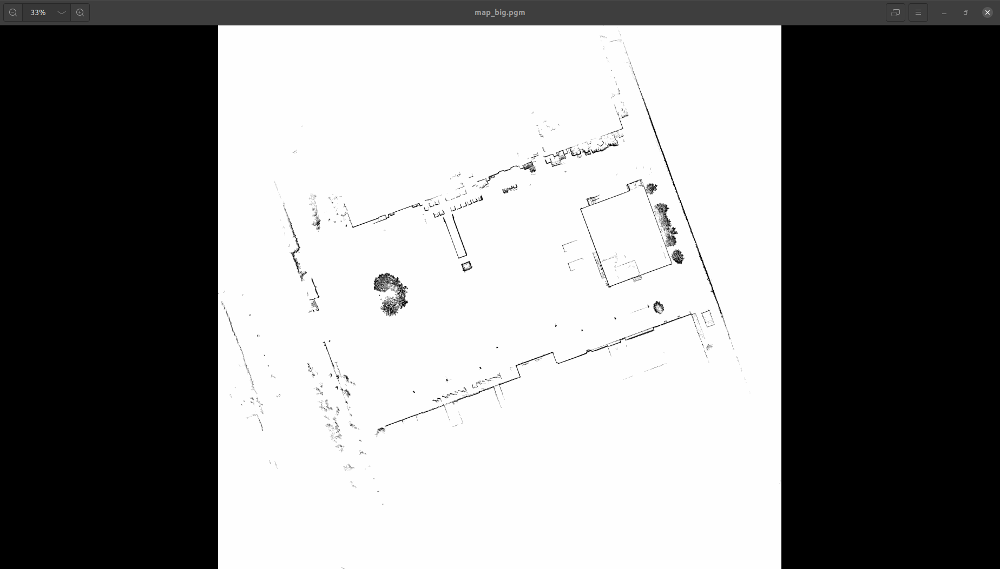
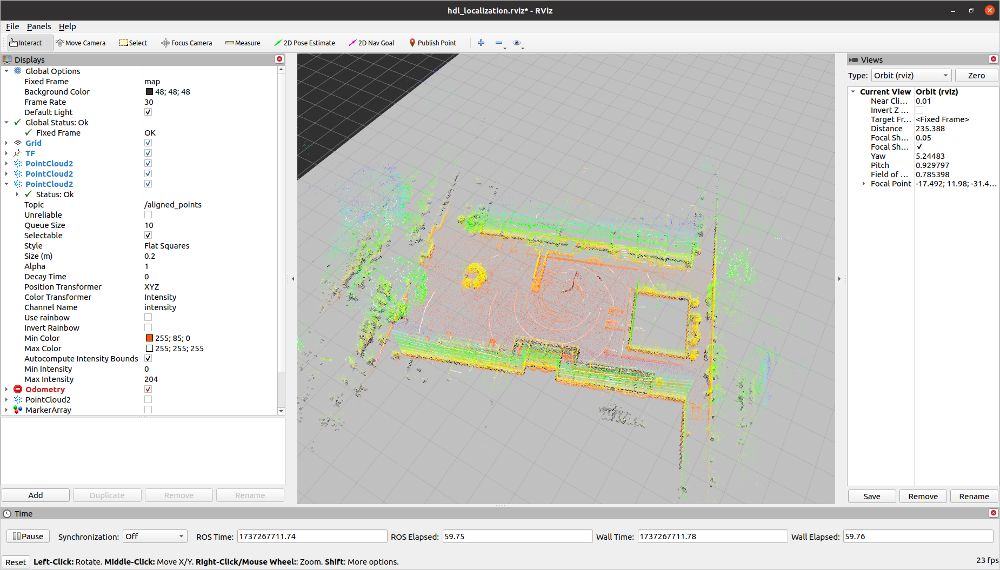

Here’s the translated version of your README in English:

---

# PicRos-Car Project Overview

Welcome to PicRos-Car! This README provides an overview of the project, environment setup, system usage, and contributions.

## Project Overview
This project implements a SLAM system for real-time mapping and navigation in both indoor and outdoor environments. Key features include:

- **Mapping**: Generating accurate maps using the 3D LiDAR-based LIO-SAM algorithm.
- **Localization**: Implementing the NTD algorithm for precise localization.
- **Navigation**: Using the ROS Noetic Navigation stack for autonomous navigation.

The system utilizes an Ackermann chassis produced by [YuHeSen](https://www.yuhesen.com/index.aspx) and a CAN bus communication framework for seamless integration of hardware and software.

## Table of Contents
1. [Development Plan](#development-plan)
2. [System Requirements](#system-requirements)
3. [Installation](#installation)
4. [Usage](#usage)
5. [System Architecture](#system-architecture)
6. [Contributing](#contributing)
7. [License](#license)

## Development Plan
- [ ] 3D Mapping
- [ ] Localization
- [ ] Navigation
- [ ] Add support for the Point-LIO localization algorithm.
- [ ] Enhance obstacle avoidance in the navigation module.
- [ ] Conduct testing and validation in diverse indoor and outdoor environments.

## System Requirements
To run this project, ensure the following prerequisites:

- **Operating System**: Ubuntu 20.04 or compatible
- **ROS Distribution**: ROS Noetic
- **Hardware**:
  - YuHeSen Ackermann chassis with CAN bus (or other vehicles with ROS SDK support)
  - Suteng RS 16-line LiDAR
  - IMU sensor (e.g., Wheel Q N100)
- **Dependencies**:
  - ROS Noetic packages: `ros-noetic-navigation`, `can-utils`

## Installation

1. Clone the repository:
   ```bash
   git clone https://github.com/your-repo/picros-car.git
   cd picros-car
   ```

2. Install required ROS packages:
   ```bash
   sudo apt install ros-noetic-ros-noetic-navigation can-utils
   ```

3. Set up the workspace:
   ```bash
   catkin_make
   source devel/setup.bash
   ```

4. Configure CAN bus communication:
   ```bash
   sudo ip link set can0 type can bitrate 500000
   sudo ip link set can0 up
   ```

## Usage

1. Launch the chassis control:
   ```bash
   roslaunch yhs_can_control yhs_can_control.launch  
   ```

   The IMU and LiDAR sensors will provide data. Once the CAN bus communication is established, the chassis control program can be started, outputting `/odom` and allowing control of speed via `/cmd_vel`.

2. Launch the mapping system:
   
   Preparation:
   ```bash
   roslaunch nav_pkg lio_map.launch # Start 3D LiDAR, IMU, and publish TF transformations
   ```

   Record data using `rosbag record -a` and play back required topics:
   ```bash
   rosbag play /imu /velodyne_points
   ```

   Then, launch the LIO-SAM mapping node:
   ```bash
   roslaunch lio_sam run.launch # Start LIO-SAM mapping node
   ```

   This will also open RViz. The mapping system uses [LIO-SAM](src/LIO-SAM/README.md).

   

   After the map is created, press `ctrl+c` in the terminal to save the map at the default location specified in [LIO-SAM configuration](src/LIO-SAM/config/params.yaml).

   **Display**:  
   Use `pcl_viewer map.pcd` to visualize the 3D point cloud:

   

   Since 2D mapping is used for navigation, you can convert the 3D map into a 2D grid map for display using [pcd2pgm](https://github.com/Hinson-A/pcd2pgm_package):

   ```bash
   roslaunch pcd2pgm run.launch
   ```

   The result:

   

3. Launch the navigation system:

   First, load the map and use the [HDL](https://github.com/koide3/hdl_localization) or [NTD](https://github.com/FAIRSpace-AdMaLL/ndt_localizer) localization algorithm, and start the node:
   ```bash
   roslaunch hdl_localization hdl_localization.launch
   rosservice call /relocalize
   ```

   

   Then, launch the ROS Noetic navigation:
   ```bash
   roslaunch nav_pkg steering move_base.launch
   ```

   Configuration is handled in `move_base.launch`.

## License
This project is licensed under the MIT License. See the LICENSE file for details.

---

Thank you for your interest in the SLAM project! For any questions or support, feel free to contact us.

---

Let me know if you need further adjustments!