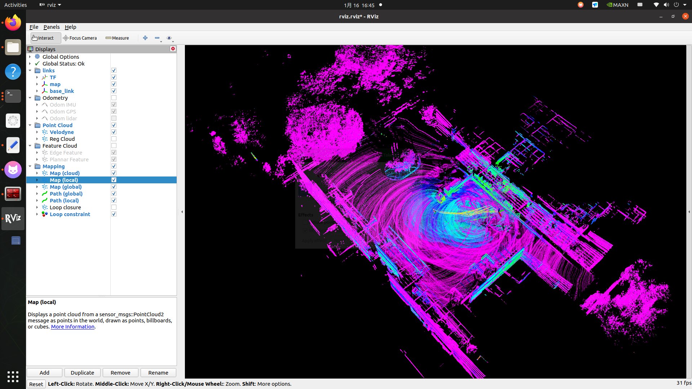
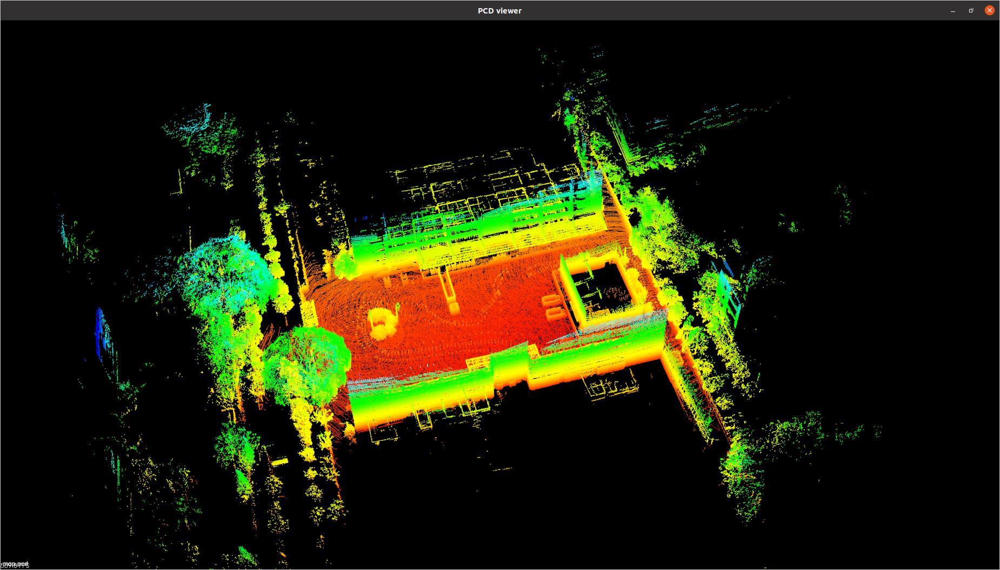
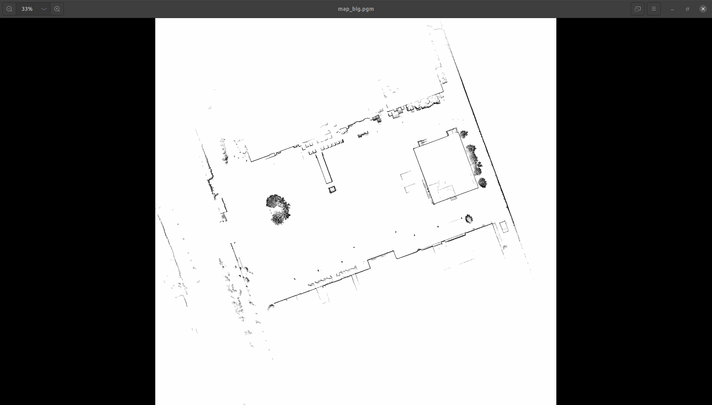

# PicRos-Car项目简介

欢迎来到PicRos-Car！本README提供了项目概述、环境配置、系统运行及开发贡献的相关说明。

## 项目概述
本项目实现了一个SLAM系统，用于室内外环境的实时建图和导航。主要功能包括：

- **建图**：基于3D激光雷达的LIO-SAM算法生成精准的地图。
- **定位**：实现NTD算法用于精确定位。
- **导航**：采用ROS Noetic导航栈实现自主导航。

本系统使用[煜禾森](https://www.yuhesen.com/index.aspx)生产的阿克曼车作为底盘，使用CAN总线通信框架，实现软硬件的无缝集成。

## 目录
1. [开发计划](#开发计划)
1. [系统要求](#系统要求)
2. [安装](#安装)
3. [使用说明](#使用说明)
4. [系统架构](#系统架构)
6. [贡献](#贡献)
7. [许可协议](#许可协议)

## 开发计划
- [ ] 3d建图
- [ ] 定位
- [ ] 导航
- [ ] 增加对Point-LIO定位算法的支持。
- [ ] 加强导航模块的避障能力。
- [ ] 在多样化的室内外环境中进行测试与验证。

## 系统要求
运行本项目需满足以下条件：

- **操作系统**：Ubuntu 20.04 或兼容系统
- **ROS发行版**：ROS Noetic
- **硬件设备**：
  - 煜禾森阿克曼底盘，带CAN总线/也可以支持其他有ros sdk支持的小车
  - 速腾RS 16线激光雷达
  - IMU传感器（如轮趣N100）
- **依赖包**：


## 安装

1. 克隆代码仓库

2. 安装所需ROS包：
   ```bash
   sudo apt install ros-noetic-ros-noetic-navigation can-utils
   ```

3. 配置工作空间：
   ```bash
   catkin_make
   source devel/setup.bash
   ```

4. 配置CAN总线通信：
   ```bash
   sudo ip link set can0 type can bitrate 500000
   sudo ip link set can0 up
   ```


## 使用说明

1. 启动底盘
   ```bash
   roslaunch yhs_can_control yhs_can_control.launch  
   ```
   imu，雷达详细说明

   开启CAN总线通讯没有问题后，启动底盘控制程序。输出`/odom` 以及可以通过`/cmd_vel`控制速度。


2. 启动建图系统：
   
   准备工作：
   ```bash
   roslaunch nav_pkg lio_map.launch # 启动 3D雷达，imu，以及发布tf变换
   ```

   这里采用先记录`rosbag record -a`，后播放rosbag中需要的 `/imu` `/velodyne_points`。命令：`rosbag play /imu /velodyne_point`

   然后启动建图节点：
   ```bash
   roslaunch lio_sam run.launch # 启动lio-sam建图节点
   ```
   同时会打开rviz
   建图系统使用 [lio-sam](src/LIO-SAM/README.md)。




建好图之后在终端`ctrl+c`保存在[lio_sam 配置文件中](src/LIO-SAM/config/params.yaml)默认的保存地址。

**显示**

使用 `pcl_viewer map.pcd ` 可以得到三维点云



由于这里仍采用2D地图进行导航，所以采用[pcd2pgm](https://github.com/Hinson-A/pcd2pgm_package)将三维地图转成二维栅格地图显示。

```bash
   roslaunch pcd2pgm run.launch
```
得到如下：




2. 启动导航系统：

   首先加载地图，并且需要用到[hdl](https://github.com/koide3/hdl_localization)定位算法,或者[ntd](https://github.com/FAIRSpace-AdMaLL/ndt_localizer)并启动节点：
   ```bash
   roslaunch hdl_localization hdl_localization.launch
   rosservice call /relocalize
   ```


   启动ros noetic的导航功能：
   ```bash
   roslaunch nav_pkg steering move_base.launch
   ```

   配置都在`move_base.launch`中。


## 许可协议
本项目基于MIT协议授权，详细信息请参阅LICENSE文件。

---

感谢您对SLAM项目的关注！如有问题或需支持，欢迎联系。

